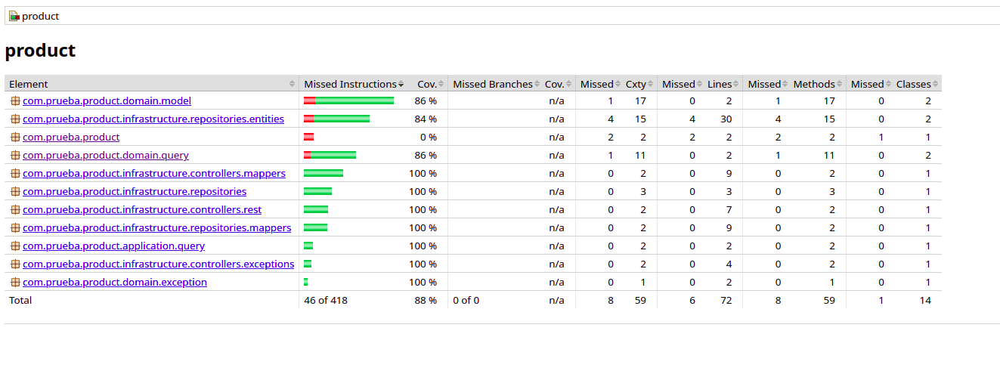

# Produt Domain

Product es  una aplicación que aporta un servicio para el precio determinado que va a tener un producto entre una fecha en concreto.

Este proyecto se ha desarrollado con arquitectura hexagonal y java 17, se ha utlizado para su desarrollo la metodología TDD, aplicando una seríe de patrones para el correcto funcionamiento, entendimiento y mantenimiento del codigo, como son los siguientes:

- Adapter
- Builder (El cual queda reflejado a la hora de utilizar la anotación builder de lombok)
- CQRS 

## Instalación

Use la siguiente url para clonar el proyecto del repositorio en la IDE que prefiera:

https://github.com/pedroJBarGa/product-domain.git

SB es compatible con Maven 3.2 o superior. Se puede consultar los pasos para realizar su instalación en la siguiente dirección http://maven.apache.org/, para este proyecto en concreto se ha utilizado 3.9.8
Es necesario tener  JDK 17 para este proyecto.

## Uso

Ejecutemos el siguiente comando para compilar el proyecto:

```cmd
mvn clean install
```

Esto también nos creará el API del servicio que hemos desarrollado y los componentes que hemos descrito en el fichero yml que tenemos en el directorio "openapi", estas clases podremos revisarlas en el directorio "target", el cual se genera automaticamente cuando compilamos.

Esto es gracias al plugin agregado al pom.xml

```xml
    <plugin>
        <groupId>org.openapitools</groupId>
        <artifactId>openapi-generator-maven-plugin</artifactId>
        <version>5.3.0</version>
        <executions>
            <execution>
                <goals>
                    <goal>generate</goal>
                </goals>
                <configuration>
                    <inputSpec>
                        ${project.basedir}/openapi/openapi.yml
                    </inputSpec>
                    <generatorName>spring</generatorName>
                    <apiPackage>com.prueba.product.infrastructure.controllers.rest</apiPackage>
                    <modelPackage>com.prueba.product.infrastructure.controllers.rest.model</modelPackage>
                    <generateSupportingFiles>false</generateSupportingFiles>
                    <additionalProperties>useTags=true</additionalProperties>
    
                    <globalProperties>
                        <modelDocs>false</modelDocs>
                        <apiDocs>false</apiDocs>
                        <apiTests>false</apiTests>
                    </globalProperties>
    
                    <configOptions>
                        <apiFrist>true</apiFrist>
                        <library>spring-boot</library>
                        <dateLibrary>java8</dateLibrary>
                        <useSpringBoot3>true</useSpringBoot3>
                        <useSwaggerUI>true</useSwaggerUI>
                        <javaVersion>17</javaVersion>
                        <skipDefaultInterface>true</skipDefaultInterface>
                        <requestMappingMode>none</requestMappingMode>
                        <javaPostProcessors>true</javaPostProcessors>
                        <reactive>false</reactive>
                        <interfaceOnly>true</interfaceOnly>
                        <useBeanValidation>false</useBeanValidation>
                        <performBeanValidation>false</performBeanValidation>
                        <openApiNullable>false</openApiNullable>
                    </configOptions>
                </configuration>
            </execution>
        </executions>
    </plugin>
```

Cada vez que se haga un nuevo desarrollo, habrá que comprobar la cobertura con el plugin de jacoco agregado al proyecto. Para verificar la cobertura, tendremos que ejecutar el siguiente comando:

```cmd
mvn clean verify
```
Si el proceso termina correctamente es que se sigue teniendo una cobertura mayor al 90%, el cual se ha asignado en la configuración del pom.
En el caso de no tener dicha cobertura, podemos ejecutar el comando:

```cmd
mvn clean test
```

Una vez termine, abrimos en el navegador el siguiente fichero /target/site/jacoco/index.html



Vendrán todos los procentajes de cobertura de los distintos ficheros, para así ver que ficheros están haciendo que la cobertura baje de las señalada en la configuración.